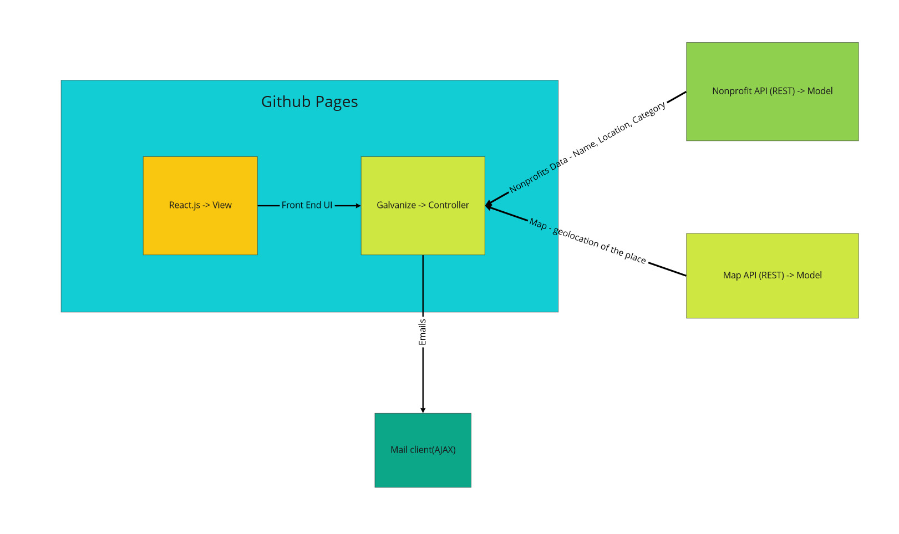

# System Diagram

# Model-View-Controller description
## Model:
- "fetchOrganization" function pulls data corresponding to the matching organization from the CSV file and returns as an object to the user
- "fecthMap" function utilizes data from the API file to get the location of an organization and uses the Google Maps API to structure and return a map object
- "userReqAPIRet" function takes the query from userRequest() and fetches data corresponding to this request
- "checkStatus" function runs a check on the Google Maps API, if it returns a code between 200 and 300, fulfill the user request. Otherwise, reject the promise
- "parseAPIData" function takes the fetched data from "fetchMap" and/or "fetchOrganization" and returns new data that contains only the usable/necessary data to the web app
- "throwErrorMessage" function will be used in the various validity checkers to display a message to the console if errors occur in the program
## View
- Email Organization Form Component: This form allows a user to send their personal information (name, email) as well as a message to the organization of their choice "formRequestHandler" function handles submission of this form component
- Volunteer Organization List Component: Displays the volunteer organizations in card view using their org name and a link to more info. "listOrganizationsHandler" function will handle user query that filters the type of org the user is looking for
- Populated Card Component: Displays a card overlay of the organizationName with links to contacting the org or seeing more info, "populatedCard" function will handle the display of this component
- Populated Map Component: Displays a map with a pin of the location of a specificied org, "populatedMap" function will handle the display of this component
## Controller 
- "listOrganizationsHandler" function handles the event of a user query on our filtration system. This will use the relevant data from the parseAPIData() function to display cards listing the volunteer organizations
- "isValidParsedData" function handles verification of usable parsedData. This will ensure that the data is not empty and therefore, the "listOrganizationsHandler" function will not break when passed this data. Throws an error message if test is failed
- "formRequestHandler" function handles user submission of the form. This will gather the inputed data (name, email, message) and forward an email/message to the selected organization on behalf of the user
- "isValidFormInput" function handles verification of valid user input to the form. This will ensure that all fields are filled out and filled with appropriate data (an actual email in the email element) to ensure empty/irrelevant are not sent to volunteer organizations. Throws an error message if test is failed.
- "userRequest" function handles user submission of the data fields the user filters by. This will identify the user's inputted filters and store the user query for use in the "listOrganizationsHandler"

# Stub functions
```
// API Functions ------------

function fetchOrganization(orgId) {
    // TODO: Get an organization from the API with a matching orgID. 
    //       Throw an exception if no matching org found.
    return {}
}

function fetchMap(map) {
    // TODO: Get a map from the Google Maps API, if no matching map, throw an exception
    return {}
}

function parseAPIData(apiData) {
    // TODO: Takes in the API Data and parses the data for usable and necessary data
    return {}
}

function userReqAPIRet(list) {
    // TODO: Fetches API data based on the filtered query from userRequest()
    return {}
}

// DOM Functions ------------

function listOrganizations(parsedData) {
    // TODO: Creates cards in the view using the parsed data passed to the function
    //       Throws and exception if the parsedData is empty
    return {}
}

function isValidParsedData() {
    // TODO: Verifies that the parsedData is not empty and therefore, usable by the listOrganizations function
    return {}
}

function populateMap(location) {
    // TODO: Display a map in our HTML using the location passed in 
    return {}
}

function populatedCard(orgData) {
    // TODO: Displays an overlay of a card detailing the org name, hours of operation, and 
    //       links to send a form or see more info
    return {}
}

// Form Functions -----------

function formRequest(name, email, message) {
    // TODO: Sends an email containing the users name, message, and email to their organization of choice.
    return {}
}

function isValidFormInput() {
    // TODO: Verifies that the formRequest has valid user input to be sent to the organization of their choice
    // throws an error message if user input is invalid
    return {}
}

function userRequest() {
    // TODO: Takes and stores users filtered query
    return {}
}

// Error Functions ----------

function checkStatus() {
    // TODO: If our API returns a code between 200 and 300, fulfill the request. Otherwise, reject the promise
    return {}
}

function throwErrorMessage(string) {
    // TODO: Throws various error messages to the console
    return {}
}
```
