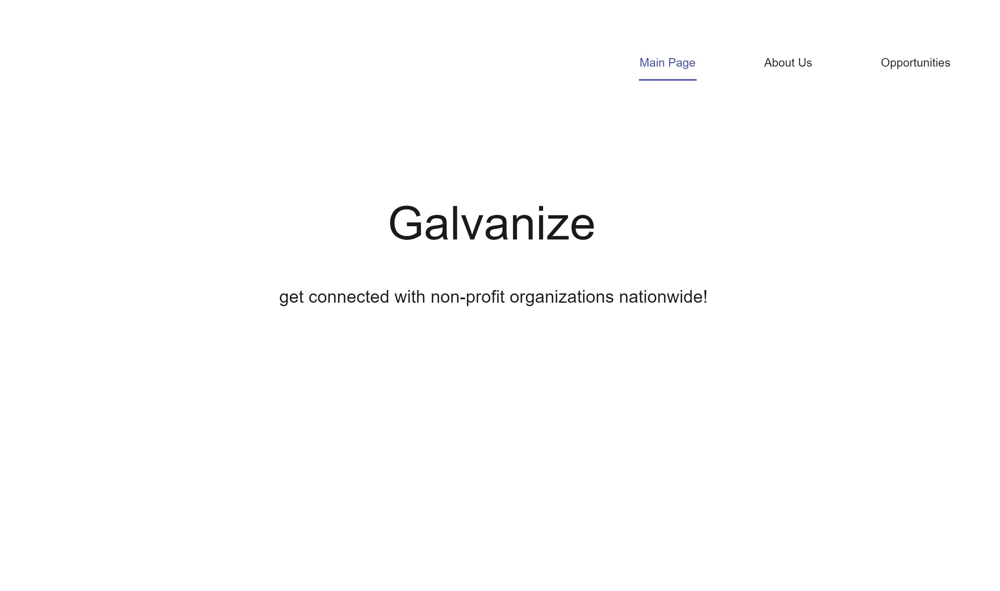
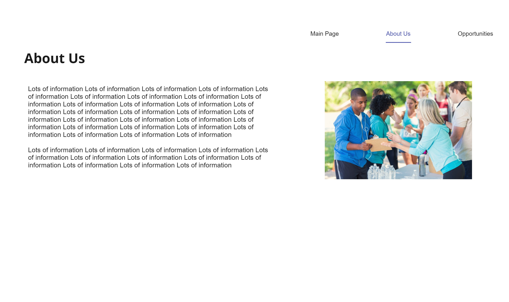
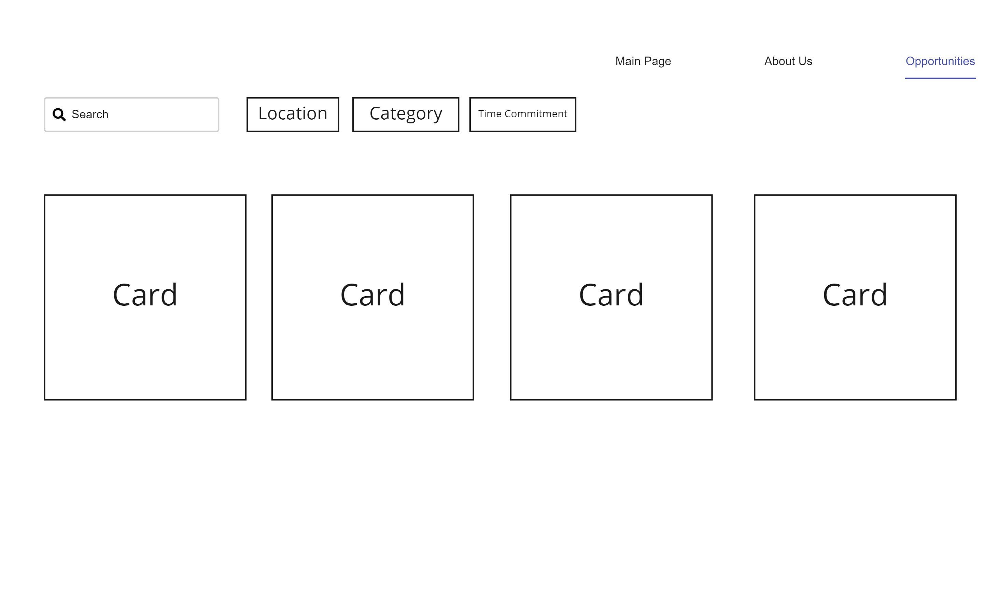
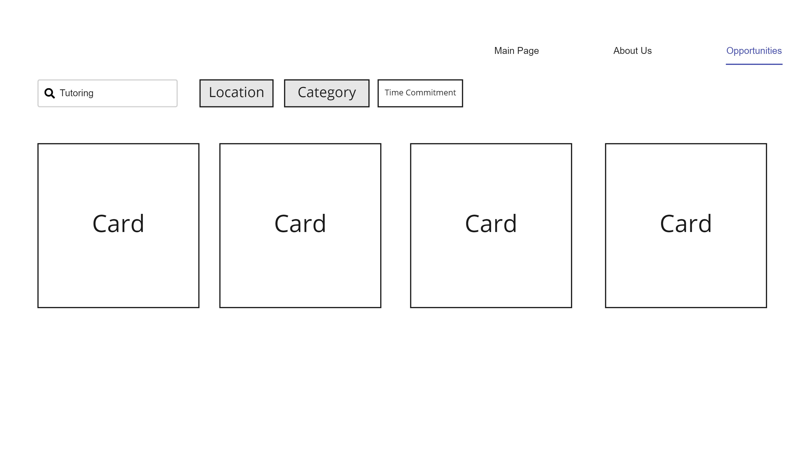
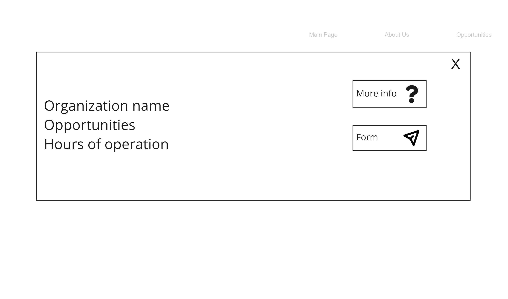
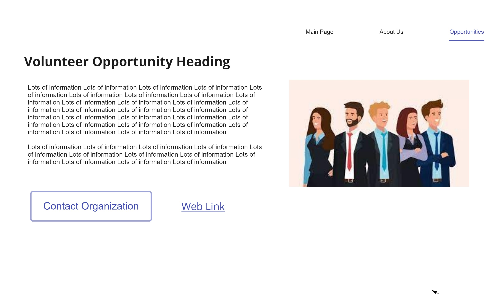
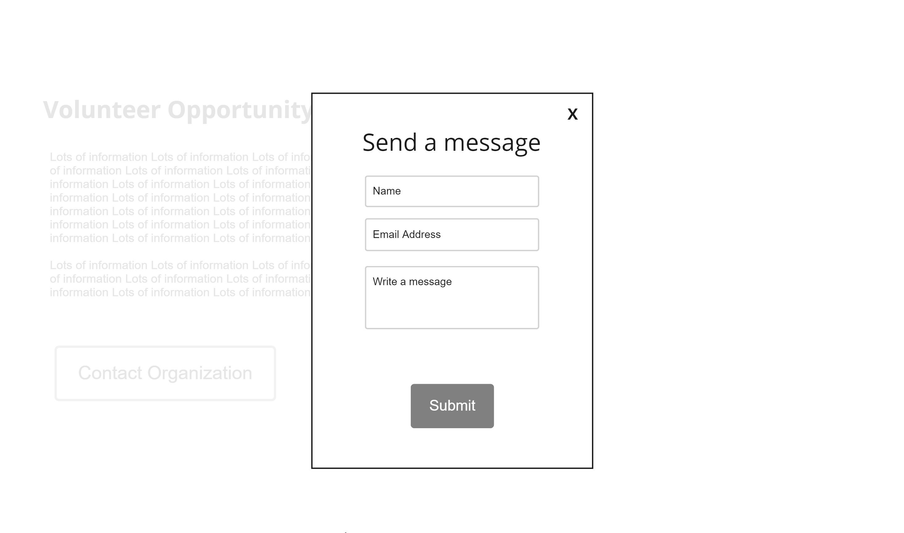
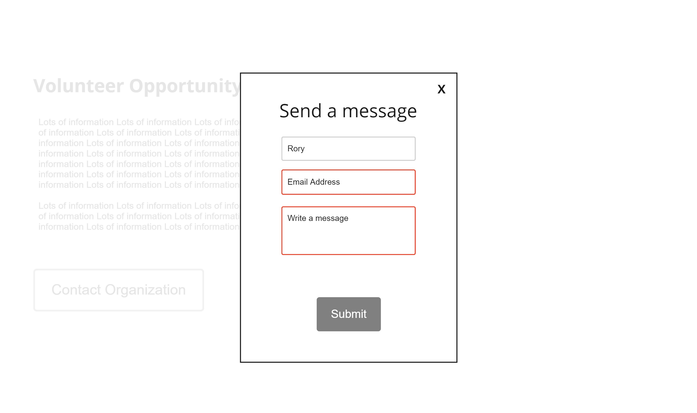
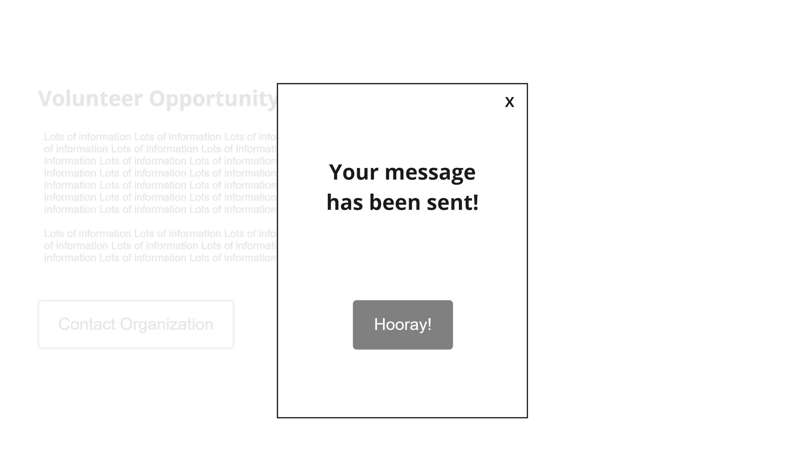

# Problem Statement:

Volunteering is a highly sought out experience that is beneficial to society and personal development. People perceive their actions to volunteer as something that’s contributing to the happiness of another person; it is an opportunity for self-fulfillment and personal development. However, with so many resources and nonprofits that support different causes, it is quite difficult to find ones that volunteers are interested in and can help make the most impact with. 

According to nonprofithub.org, there is a huge lack of information. Regarding using such technology, there is a lot of misinformation and not really a centralized place where people can go to learn more about getting involved. As discussed in the UN Sustainable Development Goal number 17, about ​​strengthening the means of implementation of these goals, because of the pandemic, organizations are having to recruit new volunteers and find more aid in terms of finances as well as hands-on. As a result, hiring and training are increasing in demand—getting this information across various websites, which is the method currently being used, is becoming a burden and inefficient (Successful Strategies for Recruiting, Training, and Utilizing Volunteers, SAMHSA). There are current solutions for this, however, as seen through wiredimact.com, some are very specific for a certain type of volunteer or SDG organization, and others are used for a wide range of hiring. Because of this, smaller nonprofits aren’t able to get their word across and get volunteers. 

## References
Goldford, J. (2021, July 2). 3 websites to help you find volunteer opportunities. Wired Impact. Retrieved October 10, 2021, from https://wiredimpact.com/blog/websites-to-help-you-find-volunteer-opportunities/.

Moore, L. F. M. F., &amp; Anderson, J. C. (n.d.). The motivation to volunteer - John C. Anderson, Larry F. Moore, 1978. SAGE Journals. Retrieved October 10, 2021, from https://journals.sagepub.com/doi/pdf/10.1177/089976407800700312.

Pauley, K. (2014, July 16). Why it's hard to be a volunteer (and to find them). Nonprofit Hub. Retrieved October 10, 2021, from https://nonprofithub.org/hard-volunteer-even-harder-find/.

U.S. Department of Health and Human Services  Substance Abuse and Mental Health Services Administration  Center for Substance Abuse Treatment. (n.d.). Successful Strategies for Recruiting, Training,  and Utilizing Volunteers . Retrieved October 10, 2021, from https://archive.org/download/www.samhsa.gov/www.samhsa.gov/sites/default/files/volunteer_handbook.pdf.

https://journals.sagepub.com/doi/pdf/10.1177/089976407800700312

Volunteermatch + seattleworks

https://www.samhsa.gov/sites/default/files/volunteer_handbook.pdf

https://nonprofithub.org/hard-volunteer-even-harder-find/

https://wiredimpact.com/blog/websites-to-help-you-find-volunteer-opportunities/

# Solution summary:
## Why our website is gonna be helpful
Crack down on seattleworks and volunteermatch: 
	Our solution aims to connect nonprofit organizations to potential volunteers by implementing a web based design that will allow users (volunteers) to be able to search, filter, and contact nonprofits that best suit their interests and needs. Other means of obtaining information about nonprofits can be difficult and convoluted (opportunities are usually introduced by acquaintances and peers, rather than a holistic source). This can make it difficult to find volunteer opportunities that are interesting and valuable. Galvanize will allow users to search volunteer opportunities by category (i.e., food service, animal care, education, etc.), search by name, or filter by location. This makes the process of finding opportunities much more viable to users, including the feature of being able to contact the organization through the website - making communication easier than ever. 
 
# Design Details
## Home Screen 
- On the Home Screen, users are introduced to this web-app and are able to learn more about the mission and get started with getting involved. From here, users can navigate to the about us page or opportunities page.

## About Us Screen 
- On this screen, users will be able to learn of our web app’s core values and purpose for connecting volunteers with other nonprofits. From this page, users may navigate to the home screen or opportunities page.

## Opportunities Screen 
- The initial screen displays various volunteer opportunities on cards. We chose cards for optimal organization and a clean look. Users may search for certain non-profit organizations or find the best opportunities through filters such as location, type of org/their purpose (category), and time commitment. We chose to utilize a filtering system because every volunteer is different and looking for opportunities that may not be the same as someone else. This will be done by utilizing set and arraylist with tags.

	
## Filtered Opportunities Screen 
- After users filter their preferences, results will be returned on the opportunities screen. Cards of the fitting organizations will be shown and users may click on those organizations to learn more about them or get connected with them (navigate to populated with a card view). However, there may come a scenario where no results are returned based on the user’s preferences and this would lead to an error message stating “no results found” and users may search with new preferences.

## Populated with a card view 
- When a user selects an organization card they are interested in, there will be a modal with brief info about the organization as well as multiple options a user is able to choose between such as contacting the organization through a form and learning more about it. Card view will be done by using div as its main DOM block.

## Volunteer Opportunities (More Info) Screen 
- If a user wants to learn more about an organization, on this screen they are able to do so. There will be a title, description, a picture, website link, and the organization’s contactrmation. From this screen, users are able to navigate back to the list of organizations, if they are uninterested, or navigate to the form in order to send a message to the organization.

## Form Screen 
- Our purpose is to connect volunteers with nonprofit organizations, thus, if users find an organization they like, they need a means of contacting them. This is the purpose of the form screen. To send a message by filling out a form with a person’s name, email, and attached message. This will let the organization know that a person is interested and would like information on how to get involved.

## Form 1
- Required Fields Unfulfilled Screen - When utilizing the form and attempting to contact organizations to get involved, we require that a name, email address, and message all be given. We chose to do this because nonprofit organizations are hard at work and striving to help others. We would like to provide these organizations with serious inquiries only to make better use of everyone’s time. Thus, all fields must be filled or an error message will be displayed asking for the required information. The syntax check will be done using a regex filter to make sure the user inputs a valid email address.

## Form 2
- Success - Once the user completes all aspects of the form and press submit, the application gives feedback saying that it was successful and a message is sent to the organization.

 # Algorithmic workflow/pseudocode
- Tag feature
  * Arraylist/set to hold all tags
  * Map of organizations (and their tags, sorted)why n and run search through them
  * Check the array criteria and tags on each category of volunteer work
and/or call it using json -> fill the view via popup window
- Card view
  * Make a div
  * Asynchronous request to prevent unnecessary refresh 
  * When x is clicked, popup window is closed without affecting the web page
- Saving tags for browsing session
  * Or save it as cookie or under localstorage
- Regex check for user input
- Submitting the form
  * Validate it first
  * submit(), then get the dom element and its contents w/i
- Error message via fetch from the server or just simple text display from a text file
